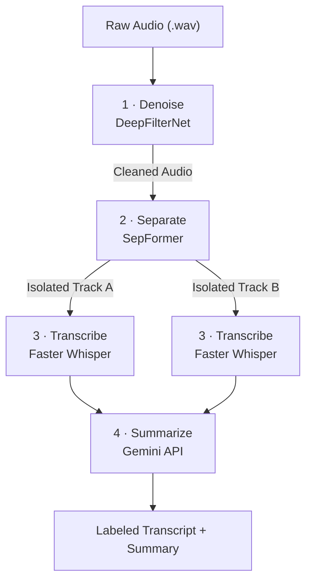
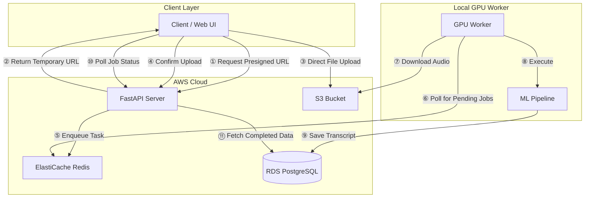

<div align="center">


# Sonclarus

**Audio Intelligence Platform**

Upload a two-person recording. Get back a clean, speaker-labeled transcript and an AI-generated summary.

[What It Does](#what-it-does) · [How It Works](#how-it-works) · [Architecture](#architecture) · [Quickstart](#quickstart) · [API Reference](#api-reference) · [Future Improvements](#future-improvements-v2)

</div>

---

## The Problem

Recording a podcast interview, a research session, or a client call typically results in a single, messy audio file. Two people are talking, sometimes over each other, often with background noise from bad acoustics or external environments.

Extracting a usable transcript traditionally requires either paying for commercial subscription services or manually listening and typing out the conversation.

Sonclarus handles this automatically. It removes background noise, separates the two voices into distinct tracks, transcribes each speaker independently using Faster Whisper, and returns a labeled transcript with a generated summary.

---

## What It Does

Given a raw audio file of two people talking, Sonclarus returns a structured output:

```
Speaker 1: So tell me about how you started the project.
Speaker 2: It came out of a problem I kept hitting at work. Every meeting
           ended with no clear record of who said what or what was decided.
Speaker 1: How long did it take you to build the first version?
Speaker 2: About three weeks for the core pipeline. The hard part was
           getting speaker separation to work on noisy recordings.

─────────────────────────────────────────────────────
SUMMARY
The conversation covered the origin of the project and the core
engineering challenges in building the audio pipeline.
─────────────────────────────────────────────────────
```

**Optimal Use Cases:** Podcast interviews, research interviews, client calls, sales calls, depositions, and 1-on-1 meetings.

> **Note:** Sonclarus is engineered strictly for two-speaker separation. It is not designed for panel discussions or group calls involving three or more participants.

---

## How It Works

Every uploaded file passes through a strictly defined four-stage machine learning pipeline.



| Stage | Model | Output |
|---|---|---|
| **Denoise** | DeepFilterNet | Clean audio with static, wind, and room echo removed. |
| **Separate** | SepFormer (`wsj02mix`) | Two isolated voice tracks extracted from a single mixed waveform. |
| **Transcribe** | Faster Whisper | High-speed, highly accurate text transcription per speaker. |
| **Summarize** | Gemini API | A concise overview of the conversation's core topics. |

---

## Architecture

Sonclarus relies on a decoupled architecture, separating the lightweight web server from the heavy GPU compute requirements.

To bypass memory bloat on the API server, clients use **S3 Presigned URLs** to upload large audio files directly to AWS. To eliminate cloud GPU costs, the machine learning worker runs on a local machine equipped with an NVIDIA GPU. The worker communicates securely with the cloud by polling the AWS ElastiCache Redis queue directly.



### Architectural Decisions

**S3 Presigned Uploads**
The FastAPI server never touches the raw 50 MB audio files during upload. This prevents RAM exhaustion on the EC2 instance and speeds up transfer times.

**ARQ Task Queue**
Replaced Celery to avoid `asyncio` event loop conflicts with `asyncpg`. ARQ is natively asynchronous and integrates seamlessly with FastAPI.

**Outbound-Only GPU Worker**
The local GPU machine does not expose any open ports or use tunneling services like ngrok. It strictly makes outbound connections to the AWS Redis queue to pull jobs and to AWS RDS to write results, maintaining strict local network security.

---

## Quickstart

### Prerequisites

-  Docker and Docker Compose
-  Git
-  A local machine with an NVIDIA GPU for the worker

### 1. Clone and Configure

```bash
git clone https://github.com/Shubhtistic/SonClarus.git
cd SonClarus
cp .env.example .env
```

Populate your `.env` file according to this configuration:

```env
PROJECT_NAME="SonClarus"

# ── Database (AWS RDS) ─────────────────────────────────────────────────────────
# Use the 'Endpoint' from your AWS RDS dashboard
POSTGRES_SERVER=your-rds-endpoint-here.amazonaws.com
POSTGRES_PORT=5432
POSTGRES_USER=your_db_username
POSTGRES_PASSWORD=your_db_password
POSTGRES_DB=postgres                          # Default unless you created a specific DB

# ── Cache (AWS ElastiCache Redis) ─────────────────────────────────────────────
REDIS_URL=rediss://your-elasticache-primary-endpoint-here:6379/0
REDIS_HOST=your-elasticache-primary-endpoint-here

# ── Security ───────────────────────────────────────────────────────────────────
# Generate a secret key: openssl rand -hex 32
SECRET_KEY=your-64-character-hex-string-here
ALGORITHM=HS256
ACCESS_TOKEN_EXPIRE_MINUTES=30

# ── AWS Infrastructure ─────────────────────────────────────────────────────────
AWS_ACCESS_KEY_ID=YOUR_IAM_ACCESS_KEY
AWS_SECRET_ACCESS_KEY=YOUR_IAM_SECRET_KEY
AWS_REGION=ap-south-1
AWS_BUCKET_NAME=your-s3-bucket-name

# ── Machine Learning & API ─────────────────────────────────────────────────────
# Obtain from Google AI Studio or your chosen LLM provider
GEMINI_API_KEY=your-gemini-api-key-here

# ── Constraints ────────────────────────────────────────────────────────────────
MAX_FILE_SIZE=52428800                        # 50 MB in bytes
DOCS_ENDPOINT=anything-you-want
```

### 2. Start the Stack

```bash
docker compose -f compose.prod.yml up -d --build
```

> The startup sequence is strictly ordered: PostgreSQL and Redis boot first, followed by Alembic migrations. Once migrations pass health checks, the API and Worker initialize.

---

## API Reference

The Sonclarus API follows REST principles, accepts JSON payloads, and relies on OAuth2 with Bearer tokens for security.

### Authentication

| Method | Endpoint | Description |
|---|---|---|
| `POST` | `/register` | Creates a new user account. Accepts `email`, `password`, `full_name` (optional). |
| `POST` | `/login` | Accepts standard OAuth2 form data (`username`, `password`) and returns a JWT access and refresh token. |
| `POST` | `/refresh` | Exchanges a valid refresh token for a new access token. |
| `POST` | `/logout` | Invalidates the current user session. |

### Ingestion

| Method | Endpoint | Description |
|---|---|---|
| `POST` | `/uploads/request` | Initiates the upload sequence. Evaluates the user's storage quota against the requested `file_size_bytes`. If valid, returns an S3 Presigned URL. Payload: `filename`, `file_size_bytes`. |
| `POST` | `/uploads/confirm/{job_id}` | Called by the client after the file is successfully pushed to the S3 Presigned URL. Triggers the ARQ worker to begin the ML pipeline. |

### Job Status and Retrieval

| Method | Endpoint | Description |
|---|---|---|
| `GET` | `/jobs` | Fetches a paginated list of all jobs owned by the authenticated user, including summaries. Query params: `skip` (default: `0`), `limit` (default: `5`), `sort` (`asc`/`desc`). |
| `GET` | `/status/{job_id}` | Returns the real-time processing stage of a specific job (e.g., `queued`, `denoising`, `transcribing`, `completed`). |
| `GET` | `/download/{job_id}` | Generates a secure, temporary download URL for specific artifacts. Query param `stage` must be one of: `separated1`, `separated2`, `transcribe`. |

---

## Future Improvements (V2)

While Sonclarus V1 provides a stable, zero-cost production pipeline, the following architectural and feature upgrades are documented for implementation in Version 2.

### 1. Job Recovery and Retries — The "Black Hole" Problem

Currently, if a job fails due to an external timeout or temporary memory constraint, it is marked as `FAILED` and stranded.

**V2 Solution:** Implement an isolated `arq` function that periodically sweeps the database for `FAILED` jobs. Because the pipeline is modular, this task will intelligently restart processing from the exact point of failure rather than starting over from the beginning.

### 2. S3 Hard Delete Sync and Storage Limit Refund

Currently, S3 storage continuously grows, and user quotas are depleted permanently upon upload.

**V2 Solution:** Implement a background task tied to user deletion requests. When a user deletes a job via the API, the system will trigger `boto3.delete_object` to wipe both the raw upload and all processed outputs from S3. The system will then accurately refund the released byte capacity back to the user's `storage_used` metric in the database.

### 3. Centralized Logging

Currently, diagnosing a pipeline issue requires checking multiple disparate environments — AWS EC2 for the API, and the local terminal for the GPU worker.

**V2 Solution:** Integrate a unified logging aggregator. All containers (API, Migrator, Worker) will stream logs to a centralized dashboard such as AWS CloudWatch or an ELK stack for synchronized observability.

### 4. Confidence Highlighting

**V2 Solution:** Leverage Faster Whisper's word-level confidence metrics to visually flag uncertain transcriptions in the UI, allowing users to easily locate and manually verify difficult audio segments.

### 5. Video File Support

**V2 Solution:** Expand the ingestion endpoint to accept `.mp4` and `.mov` files, utilizing a lightweight `ffmpeg` pre-processor to extract the raw audio payload before passing it to the standard processing queue.

---

## The Team

| Contributor | Role |
|---|---|
| **Shubham Pawar** | Core Developer |
| **Mihir Revaskar** | Core Developer |

---

## License

Distributed under the [MIT License](LICENSE).